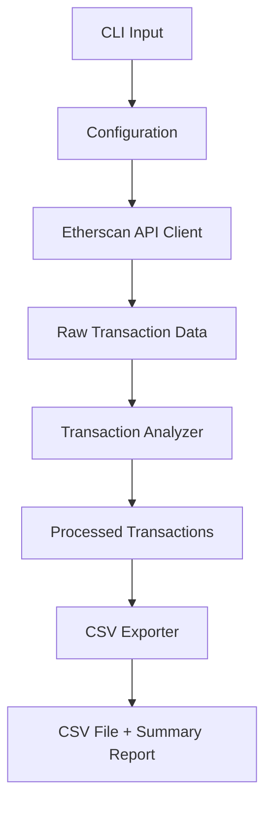

# Ethereum Transaction Analyzer


A comprehensive tool for fetching, analyzing, and exporting Ethereum wallet transaction history. Built for CoinTracker assignment with production-ready architecture, error handling, and extensibility.

## 🚀 Features

- **Complete Transaction Coverage**: Fetches all transaction types
  - Normal (External) Transfers
  - Internal Transfers  
  - ERC-20 Token Transfers
  - ERC-721 NFT Transfers
  - ERC-1155 Multi-Token Transfers

- **Professional CSV Export**: All required fields with proper formatting
  - Transaction Hash, Date & Time, From/To Addresses
  - Transaction Type, Asset Contract Address, Asset Symbol/Name
  - Token ID, Value/Amount, Gas Fee (ETH)
  - Optional extended columns for detailed analysis

- **Robust Architecture**:
  - Rate limiting and API management
  - Comprehensive error handling and logging
  - Extensible provider architecture
  - Configuration management
  - Full test coverage

- **Production Ready**:
  - CLI interface with rich argument support
  - Configurable via files and environment variables
  - Detailed logging and monitoring
  - Summary reports and analytics

## 📋 Requirements

- Python 3.8+
- Etherscan API key (free tier supported)

## 🛠️ Installation

1. **Clone the repository**:
   ```bash
   git clone <repository-url>
   cd Cointracker-TransactionAnalyser
   ```

2. **Create virtual environment** (recommended):
   ```bash
   python -m venv venv
   source venv/bin/activate  # On Windows: venv\Scripts\activate
   ```

3. **Install dependencies**:
   ```bash
   pip install -r requirements.txt
   ```

4. **Set up configuration**:
   ```bash
   python main.py --create-sample-config
   cp config.sample.json config.json
   # Edit config.json and add your Etherscan API key
   ```

## 🔑 API Key Setup

Get a free Etherscan API key:
1. Visit [etherscan.io/apis](https://etherscan.io/apis)
2. Create an account and generate an API key
3. Add it to your configuration file or set as environment variable:
   ```bash
   export ETHERSCAN_API_KEY="your_api_key_here"
   ```

## 🚀 Quick Start

**Basic usage**:
```bash
python main.py 0xa39b189482f984388a34460636fea9eb181ad1a6
```

**With custom options**:
```bash
python main.py 0xd620AADaBaA20d2af700853C4504028cba7C3333 \
  --max-transactions 5000 \
  --output ./my_exports \
  --extended \
  --filename my_wallet_analysis
```

**Large wallet analysis**:
```bash
python main.py 0xfb50526f49894b78541b776f5aaefe43e3bd8590 \
  --max-transactions 50000 \
  --verbose
```

## 📖 Usage Guide

### Command Line Interface

```bash
python main.py [OPTIONS] ETHEREUM_ADDRESS
```

#### Required Arguments
- `ETHEREUM_ADDRESS`: Ethereum wallet address to analyze (with or without 0x prefix)

#### Configuration Options
- `--config, -c`: Path to configuration file (default: config.json)
- `--api-key`: Etherscan API key (overrides config file)

#### Output Options
- `--output, -o`: Output directory for CSV files (default: ./exports)
- `--filename, -f`: Custom filename for CSV export (without extension)
- `--extended`: Include extended columns (block number, transaction index, etc.)
- `--no-summary`: Skip creating summary report

#### Processing Options
- `--max-transactions, -m`: Maximum transactions per type (default: 10000)
- `--verbose, -v`: Enable verbose logging
- `--quiet, -q`: Suppress all output except errors

#### Utility Commands
- `--create-sample-config`: Create sample configuration file
- `--validate-config`: Validate current configuration

### Configuration File

The tool supports flexible configuration via JSON files:

```json
{
  "etherscan": {
    "api_key": "YOUR_ETHERSCAN_API_KEY_HERE",
    "base_url": "https://api.etherscan.io/api",
    "rate_limit_delay": 0.2,
    "max_retries": 3,
    "timeout": 30
  },
  "export": {
    "output_directory": "./exports",
    "include_extended_columns": false,
    "create_summary_report": true,
    "max_transactions_per_type": 10000
  },
  "logging": {
    "level": "INFO",
    "format": "%(asctime)s - %(name)s - %(levelname)s - %(message)s",
    "file": "transaction_analyzer.log"
  }
}
```

### Environment Variables

You can override configuration with environment variables:

```bash
export ETHERSCAN_API_KEY="your_api_key"
export OUTPUT_DIRECTORY="./custom_exports"
export MAX_TRANSACTIONS="5000"
export LOG_LEVEL="DEBUG"
export INCLUDE_EXTENDED_COLUMNS="true"
```

## 📊 Output Format

### CSV Columns (Standard)

| Column | Description |
|--------|-------------|
| `transaction_hash` | Unique transaction identifier |
| `date_time` | Transaction timestamp (YYYY-MM-DD HH:MM:SS) |
| `from_address` | Sender's Ethereum address |
| `to_address` | Recipient's address or contract |
| `transaction_type` | ETH Transfer, ERC-20 Transfer, etc. |
| `asset_contract_address` | Contract address (for tokens/NFTs) |
| `asset_symbol_name` | Token symbol or NFT collection name |
| `token_id` | Unique identifier for NFTs |
| `value_amount` | Quantity transferred |
| `gas_fee_eth` | Total gas cost in ETH |

### Extended Columns (Optional)

| Column | Description |
|--------|-------------|
| `block_number` | Block number containing transaction |
| `transaction_index` | Position within block |
| `token_name` | Full token name |
| `token_decimal` | Token decimal places |
| `is_error` | Whether transaction failed |
| `input_data` | Transaction input data |

### Summary Report

Alongside the CSV, a summary report is generated containing:
- Transaction counts by type
- Date range analysis
- Gas fee statistics
- Top tokens/contracts

## 🏗️ Architecture

### Component Overview

```
├── main.py                     # CLI interface and orchestration
├── config.py                   # Configuration management
├── transaction_analyzer.py     # Core transaction processing logic
├── csv_exporter.py            # CSV export and formatting
├── external_data_providers/   # API client implementations
│   ├── __init__.py
│   ├── external_data_provider_base_client.py
│   └── etherscan_api_client.py
└── test_transaction_analyzer.py  # Comprehensive test suite
```

### Key Design Principles

1. **Extensibility**: Easy to add new data providers (Alchemy, Infura, etc.)
2. **Reliability**: Comprehensive error handling and retry logic
3. **Performance**: Rate limiting and efficient data processing
4. **Maintainability**: Clear separation of concerns and documentation
5. **Testability**: Full test coverage with edge cases

### Data Flow



## 🧪 Testing

### Running Tests

```bash
# Run all tests
pytest test_transaction_analyzer.py -v

# Run with coverage
pytest test_transaction_analyzer.py -v --cov=. --cov-report=html

# Run specific test class
pytest test_transaction_analyzer.py::TestEtherscanApiClient -v
```

### Test Coverage

The test suite covers:

- **API Client**: Network errors, rate limiting, data parsing
- **Transaction Analyzer**: Wei conversion, timestamp handling, transaction categorization
- **CSV Exporter**: Data validation, file operations, formatting
- **Configuration**: File loading, environment variables, validation
- **Integration**: End-to-end workflows
- **Edge Cases**: Large numbers, malformed data, network timeouts

### Critical Test Scenarios

1. **API Error Handling**: Invalid keys, rate limits, network failures
2. **Data Validation**: Malformed transactions, missing fields, type conversion
3. **Large Scale Processing**: Memory usage, performance with 100k+ transactions
4. **File Operations**: Permissions, disk space, invalid paths
5. **Configuration**: Missing files, invalid JSON, environment overrides

## 🛡️ Error Handling

### Comprehensive Error Management

- **Network Errors**: Automatic retry with exponential backoff
- **API Limits**: Rate limiting and quota management
- **Data Validation**: Graceful handling of malformed data
- **File Operations**: Permission and disk space checks
- **Configuration**: Clear error messages for missing/invalid settings

### Logging

Structured logging at multiple levels:
- **DEBUG**: Detailed API calls and data processing
- **INFO**: Progress updates and summaries  
- **WARNING**: Recoverable errors and data quality issues
- **ERROR**: Critical failures requiring attention

## 📈 Performance Considerations

### Large Address Handling

For addresses with 100k+ transactions:

1. **Pagination**: Automatic batching of API requests
2. **Memory Management**: Streaming processing to avoid memory limits
3. **Rate Limiting**: Respects API limits to avoid blocking
4. **Progress Tracking**: Detailed logging for long-running operations

### Optimization Tips

- Use `--max-transactions` to limit scope for testing
- Enable `--verbose` for detailed progress on large datasets
- Consider running during off-peak hours for better API performance
- Use configuration file to avoid repeated CLI arguments

## 🔮 Bonus: Scaling Considerations

### For Larger Scale Systems

**Database Architecture**:
```sql
-- Optimized for query performance and analytics
CREATE TABLE transactions (
    hash VARCHAR(66) PRIMARY KEY,
    block_number BIGINT,
    transaction_index INTEGER,
    from_address VARCHAR(42),
    to_address VARCHAR(42),
    value_wei NUMERIC(78,0),
    gas_used INTEGER,
    gas_price BIGINT,
    timestamp TIMESTAMP,
    transaction_type VARCHAR(20),
    INDEX idx_address_timestamp (from_address, timestamp),
    INDEX idx_address_timestamp_to (to_address, timestamp),
    INDEX idx_block_number (block_number)
);

CREATE TABLE token_transfers (
    transaction_hash VARCHAR(66),
    log_index INTEGER,
    contract_address VARCHAR(42),
    from_address VARCHAR(42),
    to_address VARCHAR(42),
    token_id NUMERIC(78,0),
    value_raw NUMERIC(78,0),
    token_standard ENUM('ERC20', 'ERC721', 'ERC1155'),
    PRIMARY KEY (transaction_hash, log_index)
);
```

**Complex Transaction Handling**:

For DeFi operations like Uniswap liquidity provision:

1. **Transaction Categorization**: 
   - Multi-step transactions → Separate logical operations
   - Contract interactions → Decode function calls
   - Token swaps → Track input/output tokens

2. **Data Enrichment**:
   - Token metadata (symbols, decimals, names)
   - Contract identification (DEX, lending protocols)
   - USD value calculation at transaction time

3. **Performance Optimization**:
   - Parallel processing with worker queues
   - Caching for contract metadata
   - Incremental updates vs full refreshes

**Trade-offs**:
- **Accuracy vs Speed**: Real-time vs batch processing
- **Storage vs Compute**: Pre-calculated vs on-demand analytics  
- **Completeness vs Performance**: All transactions vs filtered subsets

## 🤝 Contributing

1. Fork the repository
2. Create a feature branch
3. Make your changes with tests
4. Run the test suite
5. Submit a pull request

## 📄 License

This project is created for the CoinTracker technical assignment.

## 🆘 Support

For issues or questions:
1. Check the test suite for usage examples
2. Review configuration options
3. Enable verbose logging for debugging
4. Verify API key and network connectivity

---

**Built with ♥ for CoinTracker**

*A production-ready solution demonstrating clean architecture, comprehensive testing, and professional development practices.*